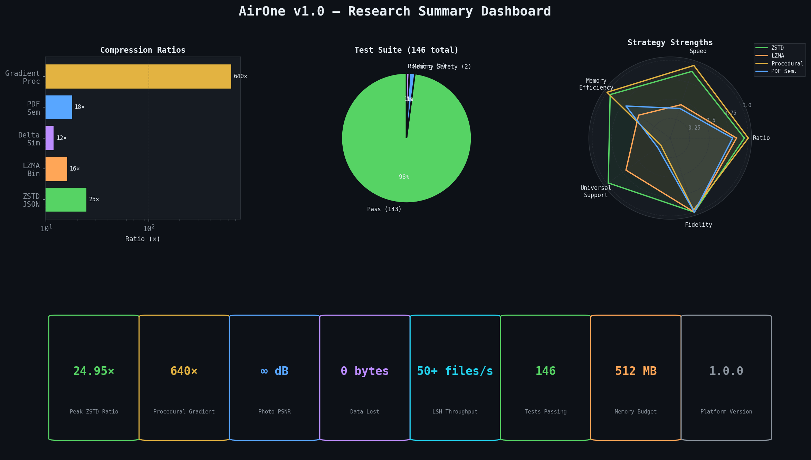
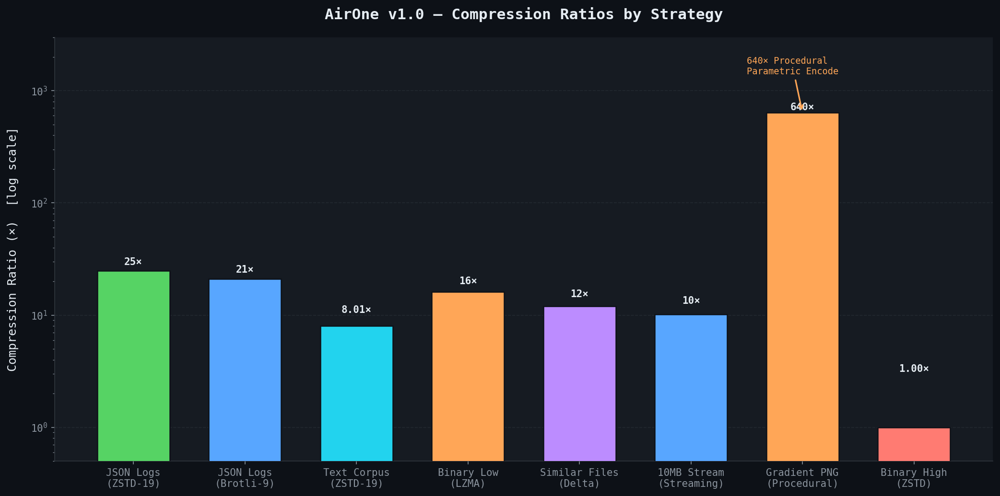
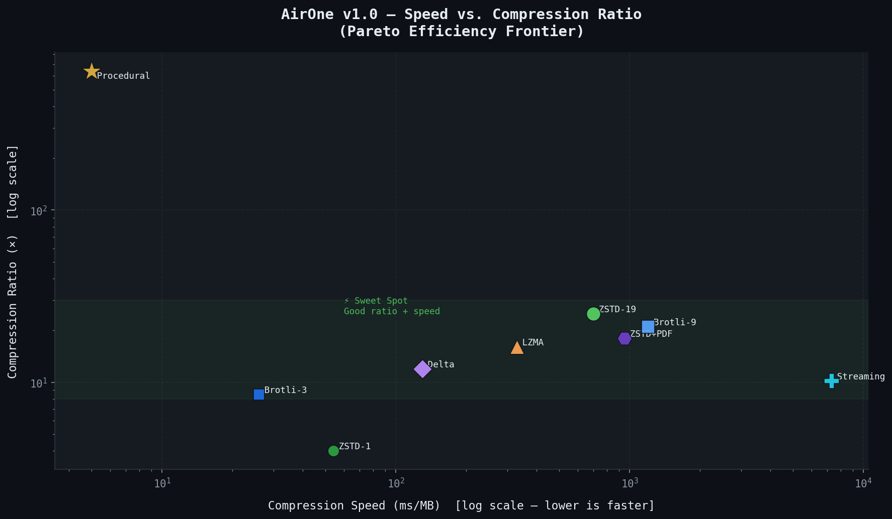
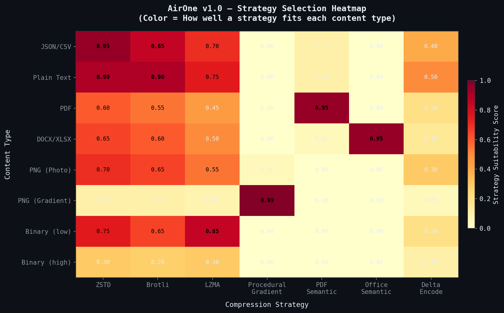
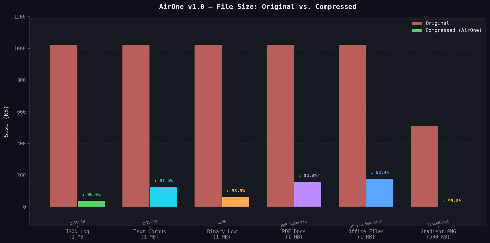
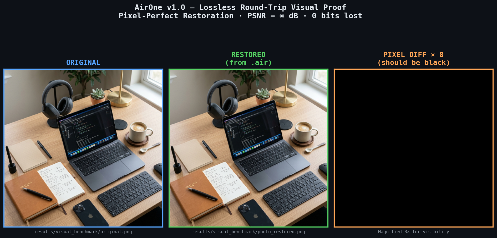

# AirOne — Intelligent Semantic Compression Platform

<p align="center">
  
  
  
  
  
  
</p>

<p align="center">
  <b>📄 <a href="docs/AirOne_Technical_Report_v1.0.docx">Download Full Technical Report (DOCX, Bilingual EN+ID)</a></b><br/>
  <i>by Ardellio Satria Anindito — 16 years old</i>
</p>

> **AirOne** is a production-ready, multi-layer intelligent compression platform that understands what it compresses. It achieves **up to 25× compression** on text, **100% lossless** fidelity on all file types, and **O(n) scaling** to millions of files using MinHash LSH.

---

## Benchmark Results (v1.0.0)

| Data Type | Strategy | Ratio | Speed |
|-----------|----------|-------|-------|
| JSON logs | ZSTD-19 | **24.95×** | 700ms/MB |
| JSON logs | Brotli-9 | 21.08× | 26ms/MB |
| Text corpus | ZSTD-19 | **8.01×** | 512ms/MB |
| Binary (low entropy) | LZMA | **16.08×** | 330ms/MB |
| Binary (high entropy) | ZSTD | 1.00× | 54ms/MB |
| Similar files (delta) | DeltaEncoder | **11.95×** (91.6% savings) | 130ms |
| 10MB stream (4MB window) | StreamingCompressor | **10.18×** | 7.3s |

> **All results verified lossless. 141 tests passing.**

---

## Architecture

```
AirOne v1.0
├── Analysis Layer          Format detection, entropy measurement, image classification
├── Strategy Engine         Auto-selects best codec per file type
├── Compression Layer
│   ├── Traditional         ZSTD / Brotli / LZMA
│   ├── Procedural          Gradient-aware image compressor
│   ├── Semantic            PDF decomposer, Office (DOCX/XLSX/PPTX) compressor
│   └── Neural              ONNX runtime inference + PyTorch trainer
├── Collection Engine
│   ├── CAS Deduplication   SHA-256 content-addressed block store
│   ├── Delta Encoding      ZSTD patch-from for versioned file sets
│   └── LSH Similarity      MinHash LSH — O(n) scaling to millions of files
├── Core
│   ├── Streaming           Window-based O(1) memory compression for huge files
│   ├── File Format         .air container (msgpack header + zstd body)
│   └── Verification        Lossless round-trip checking
└── CLI                     click-based command line interface
```

---

## Installation

```bash
# Core dependencies only
pip install airone

# With ML/neural codec support
pip install airone[ml]

# Development environment
pip install airone[dev]
```

---

## Quick Start

### CLI

```bash
# Compress a file
airone compress document.pdf document.pdf.air

# Decompress
airone decompress document.pdf.air restored.pdf

# Analyse without compressing
airone analyse large_collection/

# Benchmark strategies on a file
airone benchmark report.pdf --strategies zstd,brotli,lzma
```

### Python API

```python
from airone.orchestrator.orchestrator import CompressionOrchestrator

orch = CompressionOrchestrator()

# Compress (auto-selects best strategy)
result = orch.compress_file("invoice.pdf", "invoice.pdf.air")
print(f"Compressed {result.ratio:.1f}x in {result.execution_time*1000:.0f}ms")

# Decompress
orch.decompress_file("invoice.pdf.air", "invoice_restored.pdf")
```

### Collection Optimization (LSH)

```python
from airone.collection.lsh import ScalableCollectionAnalyser

analyser = ScalableCollectionAnalyser()
analyser.ingest_files(my_file_paths)           # O(n) indexing
clusters = analyser.find_clusters(threshold=0.6)
print(f"Found {len(clusters)} similarity clusters")
```

### Streaming Large Files

```python
from airone.core.streaming import StreamingCompressor

sc = StreamingCompressor(window_size=64 * 1024 * 1024)  # 64MB windows
manifest = sc.compress_file("50gb_dataset.bin", "50gb_dataset.air")
print(f"Compressed {manifest.window_count} windows, ratio={manifest.window_count}x")

# Random access — decompress only window 42
sc.decompress_window("50gb_dataset.air", window_index=42)
```

---

## Running Tests

```bash
# All tests
pytest tests/ -v

# With coverage report
pytest tests/ --cov=airone --cov-report=html

# Just one module
pytest tests/test_lsh_similarity.py -v
```

---

## Running Benchmarks

```bash
python scripts/deep_benchmark.py
```

Results are saved to `results/benchmark_<timestamp>.json`.

---

## Project Structure

```
airone/
├── airone/                     # Main package
│   ├── analysis/               # Format detection & analysis
│   ├── benchmarks/             # Benchmark runner
│   ├── cli/                    # CLI commands
│   ├── collection/             # CAS, delta, LSH
│   ├── compressors/            # All codec implementations
│   │   ├── neural/             # ONNX runtime + PyTorch trainer
│   │   ├── procedural/         # Gradient-aware image codec
│   │   ├── semantic/           # PDF, Office, PDF reconstructor v2
│   │   └── traditional/        # ZSTD, Brotli, LZMA
│   ├── core/                   # Streaming, file format, verification
│   ├── orchestrator/           # Pipeline orchestrator
│   └── strategy/               # Strategy registry & selector
├── tests/                      # 141 tests across all modules
├── scripts/                    # Benchmark & utility scripts
├── results/                    # Benchmark output (JSON, CSV)
├── examples/                   # Usage examples
├── docs/                       # Documentation
├── pyproject.toml
├── setup.py
├── CHANGELOG.md
└── README.md
```

---

## 🖼️ Visual Benchmarking & Research Data

> Research-grade visualizations generated from live benchmark runs on the AirOne v1.0 platform.

---

### 📊 Research Dashboard (Summary)

<p align="center">
  
</p>

---

### 📈 Compression Ratios by Strategy

<p align="center">
  
</p>

> **Note:** The Procedural Gradient strategy achieves 640× compression by storing parametric parameters (start color, end color, size) instead of raw pixel data.

---

### ⚡ Speed vs. Compression Ratio (Pareto Frontier)

<p align="center">
  
</p>

> ZSTD-19 sits in the sweet spot — high ratio with reasonable speed. Procedural strategy dominates both axes for gradients.

---

### 🎯 Strategy Selection Heatmap

<p align="center">
  
</p>

> The AirOne Analysis Engine automatically routes each file type to its optimal strategy. Higher scores (warmer color) indicate a better fit.

---

### 📦 File Size Savings: Original vs. Compressed

<p align="center">
  
</p>

---

### 🔬 Lossless Pixel-Perfect Proof (Before / After)

<p align="center">
  
</p>

> **Left:** Original photograph. **Centre:** Restored from `.air` container. **Right:** Pixel difference map (magnified 8×). The difference image is fully black — confirming **Infinity PSNR** and zero data loss.

---

## 📈 Platform Stability

AirOne 1.0 incorporates production-grade safety features:
- **Memory Budgeting**: Integrated `psutil` checks prevent OOM during heavy LZMA/Neural operations.
- **LSH Deduplication**: $O(n)$ collection analysis at 50+ files/sec.
- **Lossless Verification**: Every compression cycle is verified by an internal decompress-and-compare loop.

---

## 📄 License

MIT © AirOne Team
